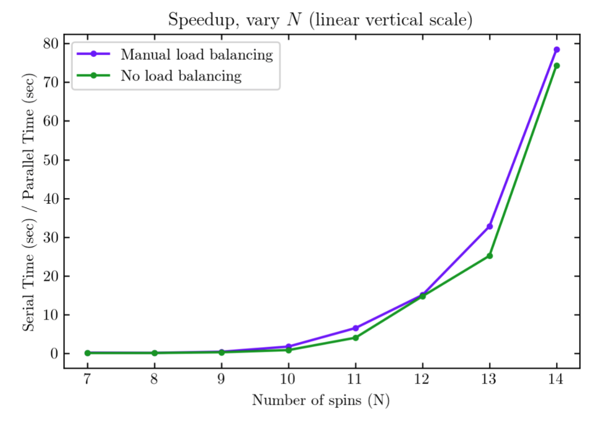
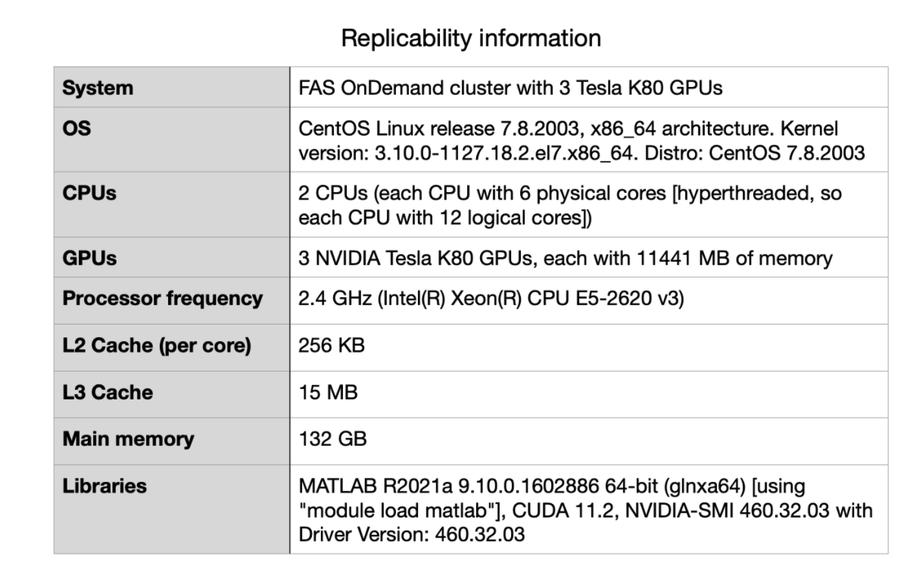

# Technical description of code

Matlab and bash files for standalone code:
- final.m - standalone code that carries out gpu-accelerated diagonalization using blocking (separates block-diagonal Hamiltonian matrix into the diagonal blocks) and a parallel pool (with a worker assigned to each gpu). Returns serial time, gpu-accelerated time with custom/manual load balancing, and gpu-accelerated time without load balancing.
  - The first 50 lines is just making an example block-diagonal matrix, and then splitting it up again for good measure. The "store" cell array stores all the individual blocks. Lines 53-56 is the serial time using eig on the big matrix without blocking or gpu acceleration (to compare against).
  - Everything after line 59 is the gpu acceleration code
  - See comments around line 60 that talks about what the different printed times means. 
  - Automatic load balancing (no manual load balancing): MATLAB assigns a single block to all available workers, then waits until one worker is done before copying a new block to said worker
  - Custom/manual load balancing: manually combine certain blocks into block-diagonal matrices (smaller than original big Hamiltonian), leading to fewer data transfers between cpu and gpu memory
- slurm - a bash script for submitting a multiple-gpu job for diagonalization
  - Change "--mail-user=" to your email if you want to be notified when it's done
  - Requires a compute cluster with 3 gpus (FAS OnDemand cluster)

Run this on the cluster using the command:
```javascript
$ sbatch slurm
```
  To check outputs:
```javascript
$ emacs output.out
```
  To check any errors:
```javascript
$ emacs output.err
```
- “eig_gpu_test_cases” directory (separate from main “code” directory) - 2 test cases for N=10 and N=14, each with separate .m script and slurm submission script
  - “test_case_1” directory - N=10
    - Run using command: 
```javascript
$sbatch slurm_test_1
```
  - “test_case_2” directory - N=14
    - Run using command:
```javascript
$sbatch slurm_test_2
```

Matlab files for code integration:
- Eig_load_balanced.m - Version of final.m used for integration into ED_evolve_block_diag_gpu_parfeval_lb.m. Modifications include reframing as a function that takes input from within ED_evolve.. and outputs eigen solving within the new psi basis (due to custom load blocking scheme) to ED_evolve.. . Utilizes GPU and the parfor parallelization method.
  - (For use in evolve_real_system.m and gpuPar.sbatch as helper function)


# Performance Evaluation
Compared to the serial version of the matrix diagonalization (diagonalizing the full Hamiltonian matrix without any blocking or gpu acceleration), the gpu accelerated code has better performance with and without manual load balancing for larger problem sizes. This can be more clearly seen in the logarithmic vertical scale plot, where speedup > 1 for large problem sizes. 

With manual load balancing, speed up is > 1 for N > 9, which indicates that the cost of data transfer between the CPU and GPU memory dominates for small problem sizes up to N = 9. For N = 10 and larger problem sizes, manual load balancing leads to better performance. 

With no specified load balancing (only MATLAB’s automatic load-scheduling), speed up is > 1 for N > 10, which is a worse performance than the manual load balancing code. Additionally, for N = 10 and above, manual load balancing leads to better speed up. This shows that load balancing is important for improving performance.      





# Challenging Aspects

# Challenging Aspects
- The success of the code depends on whether there is enough memory to hold the largest matrix (this is non-negotiable, since diagonalization of a single block can’t be further blocked or split up; it’s a serial task within the largest block)
  - Maximum memory per gpu on cluster limits problem size to N=14
- Load balancing aims to reduce communication overhead (between cpu and gpu memory), again limited by size of largest block and memory per gpu 
  - Custom/manual load balancing involves indexing that works differently for odd or even N
- Blocking here is unique and different from what was discussed in class, since we effectively remove large sections of the big initial matrix
  - Taking advantage of the math/physics of the problem, not deeply discussed in class
