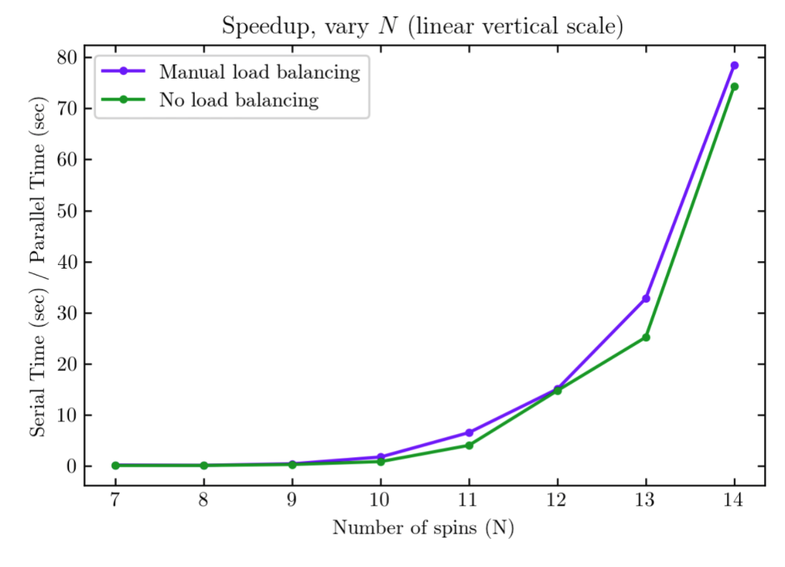
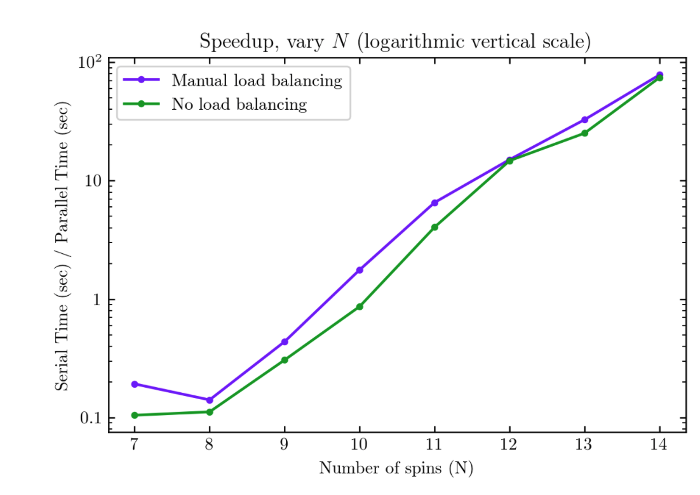
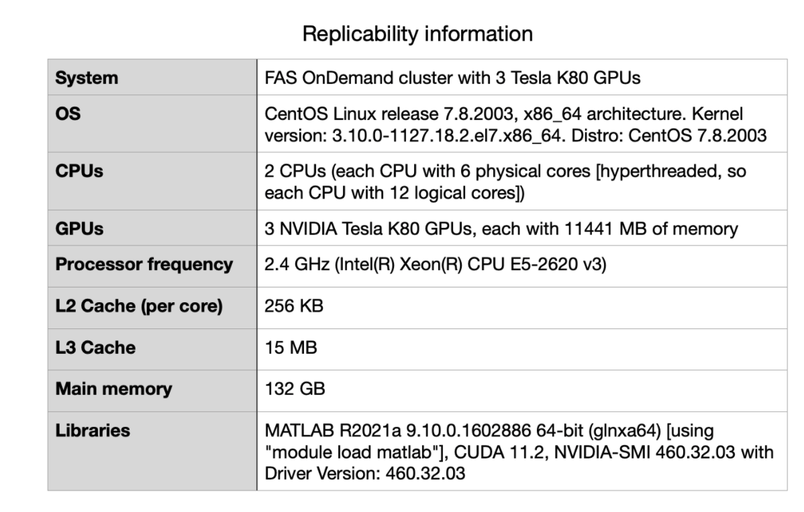

Compared to the serial version of the matrix diagonalization (diagonalizing the full Hamiltonian matrix without any blocking or gpu acceleration), the gpu accelerated code has better performance with and without manual load balancing for larger problem sizes. This can be more clearly seen in the logarithmic vertical scale plot, where speedup > 1 for large problem sizes. 

With manual load balancing, speed up is > 1 for N > 9, which indicates that the cost of data transfer between the CPU and GPU memory dominates for small problem sizes up to N = 9. For N = 10 and larger problem sizes, manual load balancing leads to better performance. 

With no specified load balancing (only MATLAB’s automatic load-scheduling), speed up is > 1 for N > 10, which is a worse performance than the manual load balancing code. Additionally, for N = 10 and above, manual load balancing leads to better speed up. This shows that load balancing is important for improving performance.      

