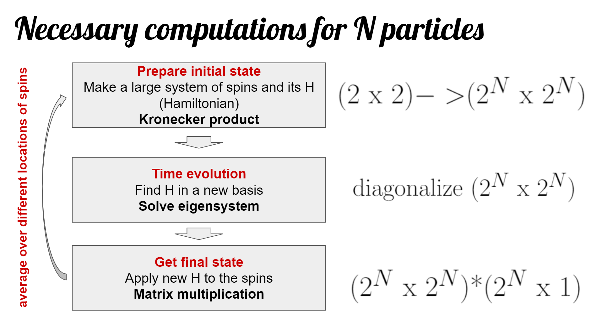
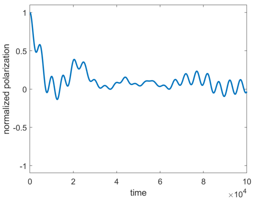
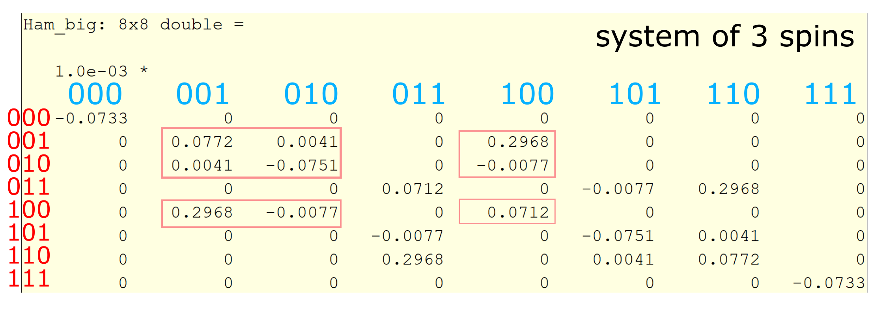

# Solving Quantum System Dynamics with Exact Diagonalization (ED) of Block-Diagonal Matrices

## Introduction to Quantum Simulations

Since Quantum Computation is a challenging topic that might be unfamiliar to some of the readers, we recommend reading either [this review](https://arxiv.org/abs/quant-ph/0404064) or a [wonderful guide](https://qiskit.org/textbook/preface.html) to quantum compuation with Python by IBM.

General statement of the problem is that we want to see how quantum systems evolve in time. This process starts with preparing a desired initial state, which will be represented by a 2<sup>N</sup> column vector. Then the initial state is evolved under a certain Hamiltonian (represented by a 2<sup>N</sup> by 2<sup>N</sup> matrix H). In order to get system dynamics, we solve Schroedinger equation, which in this case will look like a system of first order ODE set by the Hamiltonian and the initial wavefunction. We know that the solution to this system will be of the form exp(-iw<sub>m</sub>t)a<sub>m</sub>(0), where w<sub>m</sub> is one of the eigenvalues of H and a<sub>m</sub>(0) is one of the components of the initial wavefunction.

Once the initial wavefunction is evolved and we got the final wavefunction, it needs to be postprocessed to extract physical quantity of interest. To do that, we do expectation value calculation with an operator of the observable. In our simulation, we're interested in checking polarization of the final state along X, Y, and/or Z axes, so the operators of the observables are Sx, Sy, Sz.  

Since we only can simulate small numbers of spins, we'll need to average over many possible spin configurations to approximate what we expect to see from an actual big spin system. For example, strength of interaction between the spins changes with the distance between the spins, so we would be interested in averaging over many random spatial spin configurations. 

The flowchart below provides the basic outline of the computation that is done in our code:



Translated to code lines of `ED_evolve_block_diag_serial.m`:
- Prepare initial state: 42-111
- Diagonalization: 116 for the big matrix or 165 for blocks
- Final state generation: 118-129 for the big matrix or 168-187 for blocks
- Measurement: 192-218
- Generation of random spin locations values is done in `get_couplings.m` 

## XXZ Hamiltonians

Evolving an arbitrary system of N particles requires diagonalization of a 2<sup>N</sup> matrix. However, symmetries are present in many physical problems, allowing us to work with a block-diagonal matrix instead. That means that instead of working with a very large matrix, we can work with its smaller sub-blocks and just combine the results at the end. 

Presence of the symmetry means that the system has some conserved quantities, which can't change during the evolution. In our case, we work with a class of so-called XXZ Hamiltonians(S.S + XXZCoefficient*(SxSx + SySy - 2SzSz)) that conserve polarization or number of excitations in the system (you can think of it as of the total number of spin ups). 

Although we limit ourselves to this class of Hamiltonians, they capture a large variety of physical systems due to XXZCoefficient variable, which is a real number. Let's discuss some of the results that we expect (you can check them by uncommenting plotting portion of  `ED_evolve_block_diag_serial.m` (lines 222-226) and running `evolve_real_system_serial.m` with different values of P.XXZCoeff ([see this page for instructions](https://oksana-makarova.github.io/CS205-QuantumSimulations/serial_code))):

- Z polarization should never change for any values of XXZCoeff since it's a conserved quantity
- for XXZCoeff = 0 none of the polarizations should decay since S.S term commutes with the Hamiltonian
- in all other cases we expect slower or faster decay of X and Y polarizations of X and Y initial states. You might need to change evolution time to see it 

Here is an example of an X polarization plot that was produced for 10 spins with XXZCoeff = 0 and no disorder. We can see that it's decaying instead of staying fixed at 1 (note that polarization value is normalized by the number of spins).



## Working with Block-Diagonal Matrices

Let's walk through what polarization conservation means for our Hamiltonian. We'll use bit-string notation where 0 corresponds to spin down and 1 to spin up. If you prepare all your spins in state up (bit string 1111...1 of length N) they will stay like that forever because decay is not allowed. Same holds for all spins down (bit string 0000...0 of length N) since an excitation isn't allowed to appear with our Hamiltonian. Things get more interesting if we have one excitation (one spin up) in the system. Now, that allowed states are 1000...0, 0100...0, 00100...0, ..., 0000..01: excitation can hop around, so we get N possible allowed states. With two excitations we will get N choose 2 possible strings with two 1s and N-2 zeros: 11000..0, 011000...0, 101000...0, ..., 000..011. When we write out our Hamiltonian in the matrix form, its rows and columns are actually numbered according to those basis states, with off-diagonal elements corresponding to couplings between states. If it's impossible to go from the state of the row and to the state of the column that off-diagonal element is zero. Now, we can see that we get N+1 blocks of sizes N choose k (corresponding to k = 0, 1, 2, ..., N excitations) in our Hamiltonian: transitions are only allowed within the blocks but not between them, so blocks are padded by zeros. 

When we generate an XXZ Hamiltonian, it won't by default be in the block-diagonal form since basis vectors are in the incorrect order, so we need to rearrange matrix elements to bring the Hamiltonian to the desired form. In order to do that, we find out which indices correspond to which blocks and then select corresponding elements from the big Hamiltonian matrix. See example below that shows how a block with one excitation (framed) is selected out of the big Hamiltonian for 3 spins:



Code implementation: lines 138-143 and 153-160 of `ED_evolve_block_diag_serial.m`:
```
all_states = de2bi(0:2^NN-1, 'left-msb'); %our states are binary numbers with 0/1 <->spin up/down
exc_in_a_row = sum(all_states, 2);
[~, blocking_indx] = sort(exc_in_a_row); %used to select correct rows/columns out of big Ham

blk_sizes = 0:NN;
blk_sizes = arrayfun(@(z) nchoosek(NN, z), blk_sizes); %sizes of each of the blocks, used for indexing

....

for blk_num = 1:(NN+1)
    first_indx = sum(blk_sizes(1:(blk_num-1))); %first state index for this block
    selected_indx = blocking_indx((first_indx + 1):(first_indx + blk_sizes(blk_num)));

    %pick out elements for blocks from H based on blocking index
    Ham_blk = Ham_big(selected_indx, selected_indx);
    psi_blk = psi_i(selected_indx);

```

Once the block is formed, we process it in the same way as we would process the original large matrix with the only exception that we also need to select a small subsection of the wavefunction on which it operates, since dimensionality must match (lines 168-187 of `ED_evolve_block_diag_serial.m`). We'll notice later in our code that this extra change of basis that needs to be done if you want to combine different blocks together leads to extra operations and slow down of our custom GPU load balancing code.


#### [Back to home page](https://oksana-makarova.github.io/CS205-QuantumSimulations/)
