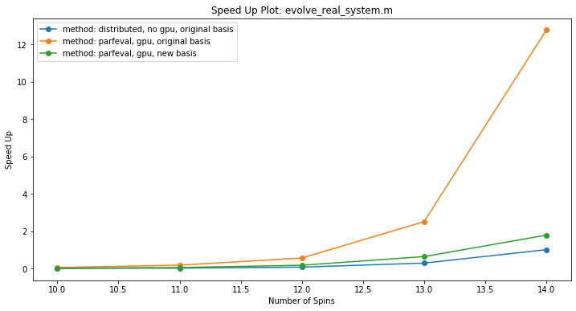
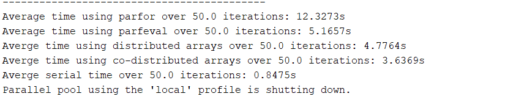
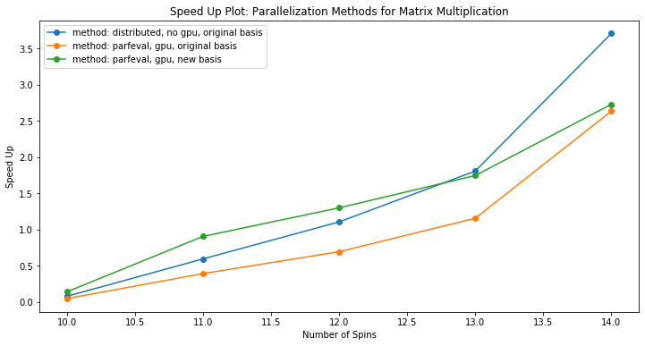
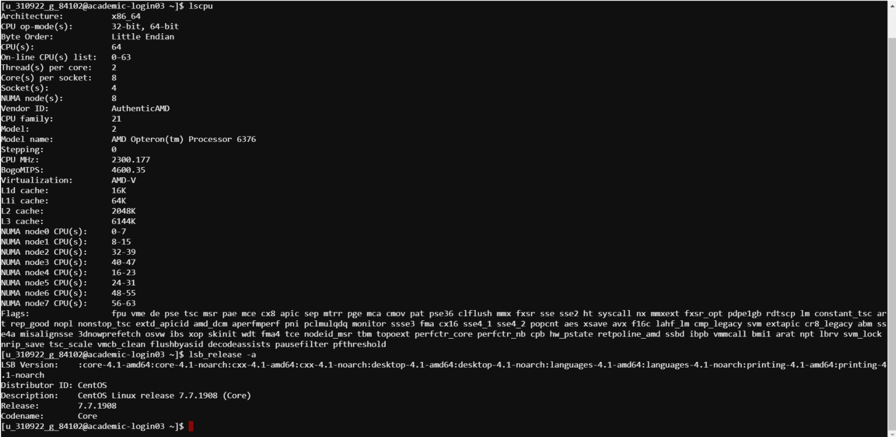

# Technical description of code
## Entire code
Matlab and Bash files:
- evolve_real_system.m - main file for simulating the physics of our system. Use this file to specify things such as number of spins, number of time steps, and type of evolution method (described below)
- ED_evolve_block_diag.m - serial implementation of system evolution. No parallelization methods are introduced, and does not use GPU. Use for comparison with other evolution methods
- get_couplings.m - !!!!
- gpuPar.sbatch - a bash script for submitting evolve_real_system.m to the academic cluster. 

- Instructions: 
Upload entire repo to the academic cluster and cd into the ‘code’ folder. Open parallel.sbatch and modify the username@g.harvard.edu to your specific harvard email. Modify the last line to include different helper functions such as eig_load_balanced.m and other parallelization methods for ED_evolve. Customizations include:
Number of gpus (if applicable)
Size of memory
Run gpuPar.sbatch on the cluster as: 
```
$ sbatch gpuPar.sbatch
```
Check outputs and errors (respectively via): 
```
$ vim output.out
$ vim output.err
```
If you get the error “Batch script contains DOS line breaks (\r\n) instead of expected UNIX line breaks (\n)” the run the following command:
```
$ dos2unix sbatch gpuPar.sbatch
```
## Parallelization of Matrix Operations

Matlab files:
- ED_evolve_block_diag_distributed.m - parallelization method for system evolution using distributed and co-distributed arrays. This method focuses on parallelizing matrix multiplication by distributing data amongst workers in a parallel pool, and is not compatible with GPU simulations. 
(For use in evolve_real_system.m and gpuPar.sbatch as helper function)
- ED_evolve_block_diag_gpu_parfeval.m - parallelization method for system evolution using parfeval and GPU arrays. This method does not use distributed arrays due to their incompatibility with GPU array operations. GPU is utilized for speeding up eigen solving the system Hamiltonian (block diagonal matrix). Parfeval is utilized for matrix multiplication after eigen solving, with the multiplication function distributed amongst workers in a parallel pool. 
(For use in evolve_real_system.m and gpuPar.sbatch as helper function)
- ED_evolve_block_diag_gpu_parfeval_lb.m - parallelization method for system evolution using parfeval and GPU array operations. The difference between this and ED_evolve_block_diag_gpu_parfeval.m arises from how the system Hamiltonian becomes a block diagonal matrix; here superpositions of different blocks of the large matrix are eigen solved individually to aid in load balancing. 
(For use in evolve_real_system.m and gpuPar.sbatch as helper function)
- Parallelization_methods_testing.m - exploration of different parallelization methods that are available from MATLAB’s Parallelization Toolbox: parfor, parfeval, spmd, distributed arrays, co-distributed arrays. Can run as is for testing different timings for large matrices. The code times (with averaging) each method, with comparison to serial implementation for the following situations: 
	- Random matrix generation
	- Random (symmetric and non-symmetric) matrix multiplication
	- Random symmetric matrix multiplication with distributed data blocks
	- Random symmetric matrix eigen solving


# Performance Evaluation
## Entire code
See the sections that follow for an in-depth explanation of why the specific methods were chosen for optimizing performance. The integration of these methods (outside of work done in PySpark) is shown in this speed up plot, where the serial implementation was performed on 1 core:




As shown, the method of using parfeval with GPUarrays in the original basis approaches MATLAB's black box optmization for CPUs (see Physical Model Description in main branch). The load-balanced optimization method (see GPU-accelerated diagonalization in main branch) is hindered by the change in basis from matrix concatenation. Using distributed arrays requires data to be distributed unevenly amongst workers, which may need lead to increase in timing due to communication overhead.

See reproducibility in “Parallelization of Matrix Operations”

## Parallelization of Matrix Operations
Matrix multiplication is required to properly evolve the states in this simulation, and MATLAB provides several tools to parallelize matrix operations. Their descriptions are included within the first comment block of parallelization_methods_testing.m:
- parfor (method)
- parfeval (method)
- spmd (method)
- distributed arrays (data type)
- co-distributed arrays (data type)

Each of the above tools was used in testing the time required to multiply two random matrices of size 2^N x 2^N, with N = 12. The test was repeated for n = 50 iterations, and the average timings of each method were as follows (all are without using GPUs):



Given this, parallelizing the relevant segment of our ED_evolve_block_diag.m code (lines 160-171 and the associated for loop) was done via co-distributed / distributed arrays with no GPU and via parfeval using GPU arrays. The speed up from a serial implementation of the same lines in ED_evolve_block_diag.m using 1 core was found to be:



We see that for larger numbers of spins, co-distributed / distributed arrays achieve greater speed up whereas for smaller spins, our custom load-blocking method with GPU arrays and parfeval gives a greater speed up. The difference between the two parfeval with GPU array trials here (orange and green lines in plot) comes from the block size difference coming out from eigen solving our system Hamiltonian.

Since the distributed arrays trial was done without GPUs, combined with the fact that distributed arrays require communication amongst workers in the parallel pool and parfeval does not, this speed up shows that optimized communication reduces the bottleneck, implying that our matrix multiplication is a fine grained application. 

Reproducibility




# Challenging Aspects

## Entire code
- Integration of the various methods described above was the most challenging aspect of the entire code. Different methods require different procedures, given MATLAB’s preferences, which makes debugging taxing.
- Change of basis for load balancing of Hamitlonian block matrices proved to be a major hindrance to the desired speedup for this method. The idea of putting multiple matrices together to have an equal amount of work (for eigen solving) per MATLAB pool worker also requires a new basis (for matrix multiplication) in post processing. The result is an increase in timing due to additional iterations of multiplications in the new basis.

## Parallelization of Matrix Operations
- Understanding how best to partition input data is important for optimizing the timing of these methods. While co-distributed arrays allow the user to do this at their discretion, the other methods require evenly splitting resources amongst workers in a parallel pool or leaving some workers in the pool out of the computation
- Combining GPU arrays with the methods described is also challenging. Like cell arrays, GPU arrays require different syntax than vectors or matrices, and in the case of distributed arrays they are incompatible.


