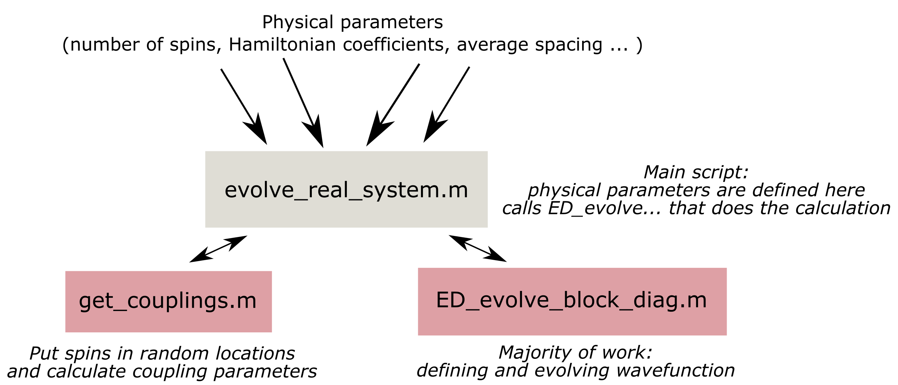
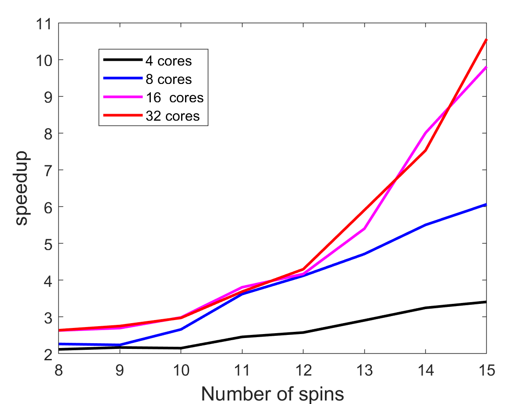
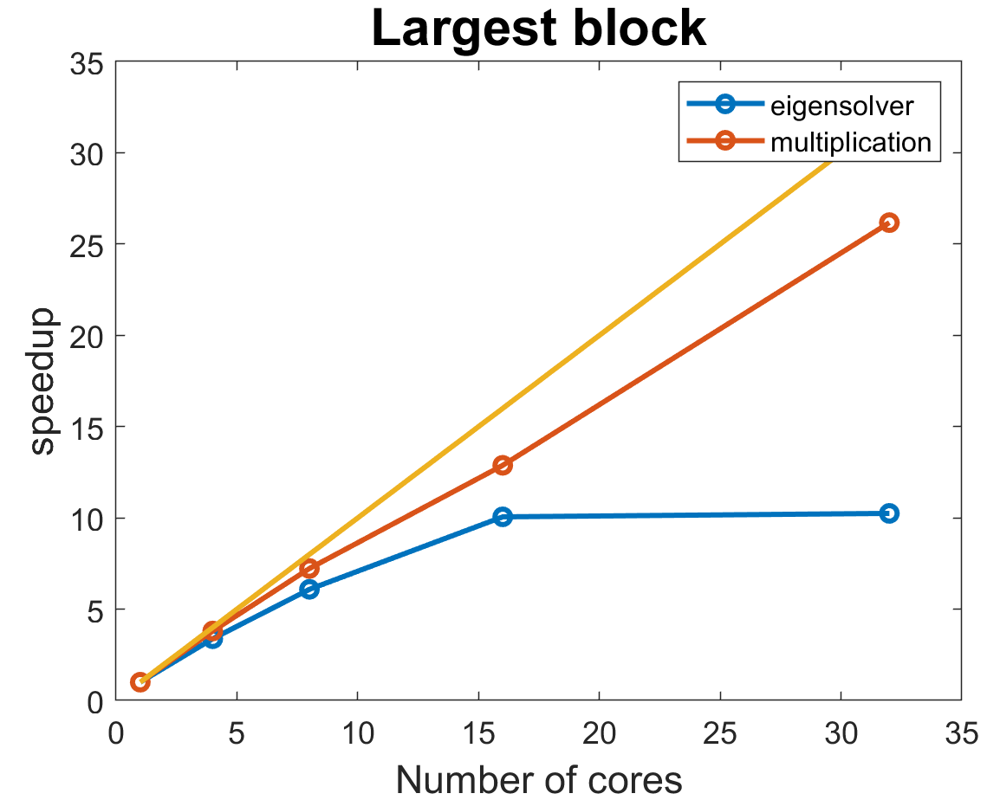
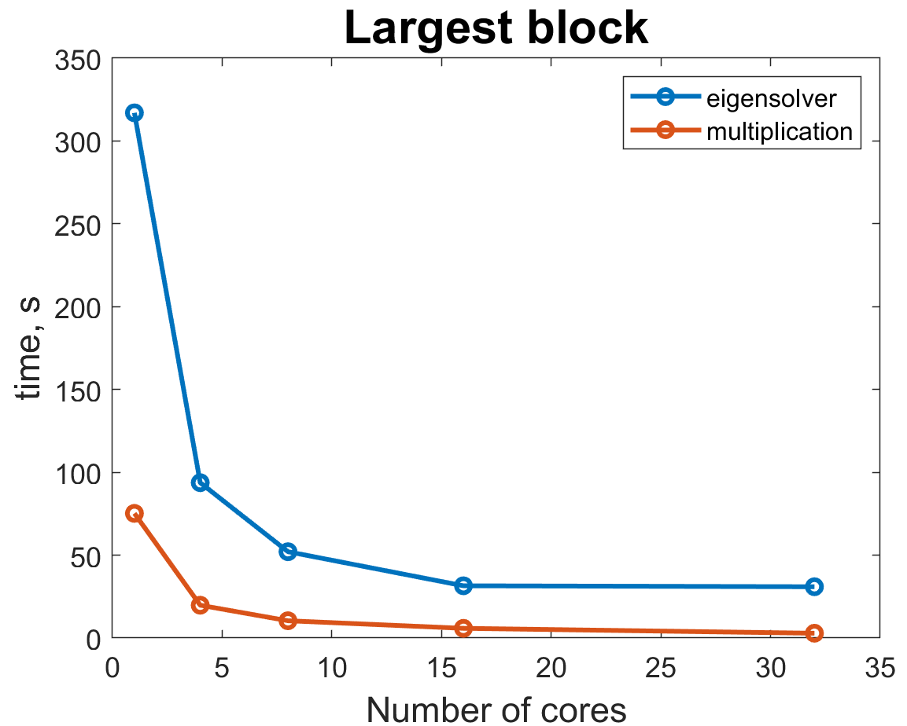

# "Serial" code implementation 

**Note 1**: the code described in this section is in our GitHub repo in code/serial directory. Description of the performed operation is described on the **paste** page. 

**Note 2**: for this project, we had to write write a script for evolution of a quantum system with a block-diagonal matrix from scratch (`ED_evolve_block_diag_serial.m`), while the other two functions `(evolve_real_system_serial.m` and `get_couplings.m`) were inspired by code that was provided by Leigh Martin from Lukin group. Those two functions contain physical parameters of an actual quantum system and are used to make the new code compatible with the rest of the code base in the future.

This subpage describes **structure and testing of the base version of the code that doesn't contain any explicit parallelization or accelration**. However, the word serial in the title is taken in quotation marks because a lot of MATLAB built-in functions and operations are multithreaded by default and can run on multiple cores (but not nodes). Quoting MATLAB website:

>“Generally, if you want to make code run faster, first try to vectorize it. For details how to do this, see [Vectorization](https://www.mathworks.com/help/matlab/matlab_prog/vectorization.html). Vectorizing code allows you to benefit from the built-in parallelism provided by the multithreaded nature of many of the underlying MATLAB libraries. However, if you have vectorized code and you have access only to local workers, then parfor-loops may run slower than for-loops. Do not devectorize code to allow for parfor; in general, this solution does not work well.”

Since MATLAB tries to automatically take care of shared memory parallel processing, it expalins why **Parallelization Toolbox's main focus is Distributed-Memory parallel processing**. Even the default option for a pool of parallel workers is [Process-Based Environment](https://www.mathworks.com/help/parallel-computing/choose-between-thread-based-and-process-based-environments.html) instead of Thread-based environment where workers share a common data pool. Therefore, in order to capture MATLAB's default behavior, we tested base code execution with different numbers of cores (between 1 and 32). Unfortunately, MATLAB's *[maximum number of computational threads is equal to the number of physical cores on your machine](https://www.mathworks.com/help/matlab/ref/maxnumcompthreads.html),* so when we request an instance with 64 coreson the cluster, MATLAB sees it as an instance with 32 cores. 

All testing that is desriben on this page was performed on Harvard Cannon cluster on an instance with 64 logical cores (see parameters below):

```javascript
  $ salloc -c 64 --mem=32G -t 240
  $ lscpu    
  Architecture:          x86-64
    
  CPU op-mode(s):        32-bit, 64-bit

  Byte Order:            Little Endian

  CPU(s):                64

  On-line CPU(s) list:   0-63

  Thread(s) per core:    2

  Core(s) per socket:    8

  Socket(s):             4

  NUMA node(s):          8

Vendor ID:             AuthenticAMD

CPU family:            21

Model:                 2

Model name:            AMD Opteron(tm) Processor 6376

Stepping:              0

CPU MHz:               2300.022

BogoMIPS:              4600.04

Virtualization:        AMD-V

L1d cache:             16K

L1i cache:             64K

L2 cache:              2048K

L3 cache:              6144K
```

If you would like to replicate our results, copy the three scripts from GitHub repo *code/serial* directory to your cluster/machine.

Our cluster has pre-installed MATLAB, so in order to run our code in interactive mode, we used the following commands:

```javascript
$ module load matlab/R2021a-fasrc01
$ matlab -nodisplay -nojvm -nosplash
```

Once MATLAB interactive session loaded, we used the following command to run and edit the scripts:

```javascript
>> setenv('EDITOR', 'vim'); %allows you edit files in the interactive mode
>> evolve_real_system_serial
```
Since by default MATLAB would try to use all available threads, we specify number for each test using a command `LASTN = maxNumCompThreads(N) `, where N is the desired number of threads. 

`evolve_real_system_serial.m` would call two other functions and evolve a quantum system of various sizes (for example, for 7, 8, 9, and 10 spins in the version on GitHub). It would output timings of the potential code bottlenecks. If you would like to simulate a system with other parameters, you can find their descriptions in the script.



Majority of the computations and timing is done in the `ED_evolve_block_diag_serial.m`, so refer to it for the details of the implementation. Also please note that there are a some commented out portions which allow for extra functionality, such as plotting of the results and evaluation of the problem without bringing it to block-diagonal form. Additionally, it's possible to test that function separately by generating a random `Jmat` matrix inside of it instead of providing it from the `get_couplings.m` function. 

To evaluate code performance, we focus on speed up of the total evolution time and timings of the eigensolver and matrix multiplications for the largest block of the matrix(since they take up majority of the time). Note that we ensured that matrices are exactly the same for different numbers of cores by specifing a certain random seed number.



First, we focus on speed up of the whole code. The values were normalized to the truly serial run with a single thread. For the serial code, 15 spin simulation took 1308.7 seconds, while 32 thread version only took 126.7844 seconds. As we can notice, speed up keeps on increasing for larger system sizes, especially for 16 and 32 cores. It's likely that 32 cores will show an even better speed up for 16+ spin system. The  speedup  increases  with  problem  size,  so  each  processor  actually  could  do  more  work  before synchronization,  meaning  that  communication  overhead  is  a  problem.  Therefore,  this  case  is  fine-grained (computation to communication ratio is low). 



Now, we analyze the most time consuming operations for the largest block (that would be (15 choose 7) = 6435 by 6435 matrix)). MATLAB is really good at parallelization of matrix multiplication that achieves an almost linear scaling with the number of cores. Meanwhile, eigensolver platoes at 16 cores, while still taking up the largest fraction of the computation time. When we did our research of eigensolver implementations, all of them were very difficult to parallelize, so demonstarted speed up is already pretty impressive and it's possible that MATLAB's algorithm just can't handle more than 16 cores.    



If we look at the actual timings of these operations, we can see that since matrix multiplications scale much better with the number of cores, eigensolver takes up larger portion of the total time for larger number of cores. Ratio of eigensolver to multiplication time changes from about 3.5 for 4 cores to 8 for 32 cores. Therefore, we were hoping that custom load balancing in our implementation would help speed up eigensolver even further as it remains the main bottleneck. 

#### [Back to home page](https://oksana-makarova.github.io/CS205-QuantumSimulations/)
